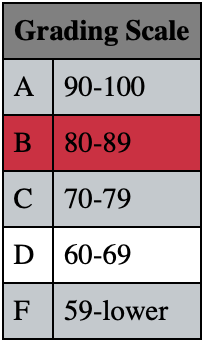

# Grade Finder

Web 4: [Level 4 — Project 2](https://in-info-web4.luddy.indianapolis.iu.edu/~karia/newm-n220/final-projects/level-four/grade-finder)

## Instructions

Using the array below, generate a table through javascript so that the table appears like the one below.

`let gradingScale = ["A", 90, 100, "B", 80, 89, "C", 70, 79, "D", 60, 69, "F", 59, "lower"];`

Create an input where the user enters their point total. (Note: use a placeholder that indicates the max points possible is 500.)

Create a button that reads _Your Grade_. Once the user clicks on that button, two things will happen:

- The user's grade percentage will appear on the page.
- The letter grade line of their percentage will be highlighted in a color.
- When the user enters a new value, the colored line will return to normal and the new grade line will be highlighted.

### Example Result:

- Input: 432
- Result: Grade Average: 86.40%

