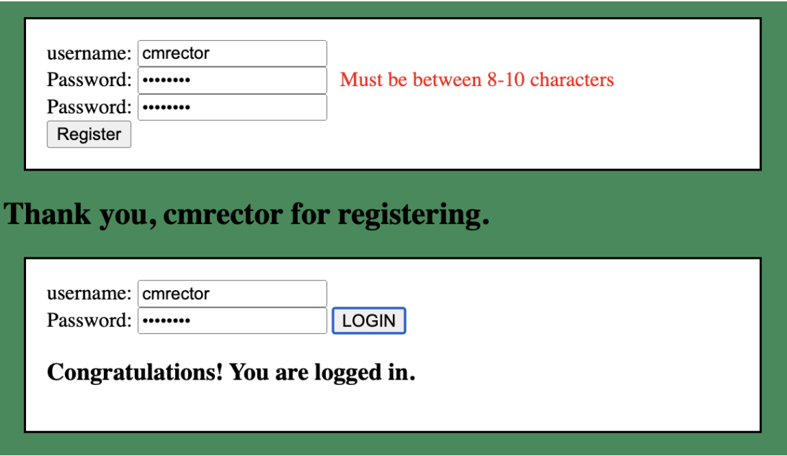

# Login Page

Web 4: [Level 3 — Project 4](https://in-info-web4.luddy.indianapolis.iu.edu/~karia/newm-n220/final-projects/level-three/login-page)

## Instructions

This page will consist of two sections:

- Login registration
- User Login

**<u>Login Registration</u>**

You will create three input fields:

1. username
2. Password
3. Second Password field
4. Register Button

_NOTE: the password fields should be of password type._

The user will enter their user name and their password twice. The password must be between 8-10 characters. The passwords must be of the correct length and match in order to register the user. If the passwords do not meet the length requirement, a message should appear that reads "Must be between 8-10 characters." If the passwords do not match, a message should appear that reads "The passwords must match." If the user get registered, a message should appear that reads "Thank you, username for registering," where username is the username they entered.

**<u>User Login</u>**

You will create three input fields:

1. username
2. Password
3. Login Button

The user will enter their username and password. If it matches what is on file, a sentence should read: "Congratulations! You are logged in." If the information does not match what is on file, a sentence should appear that reads: "Your login information does not match those on file. Please try again."

### Example Result:

